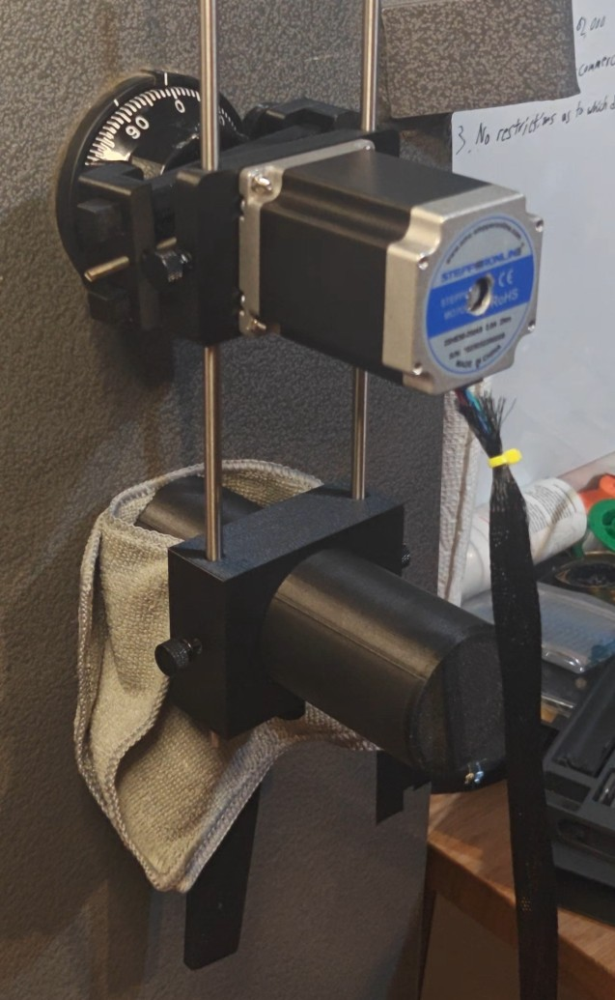
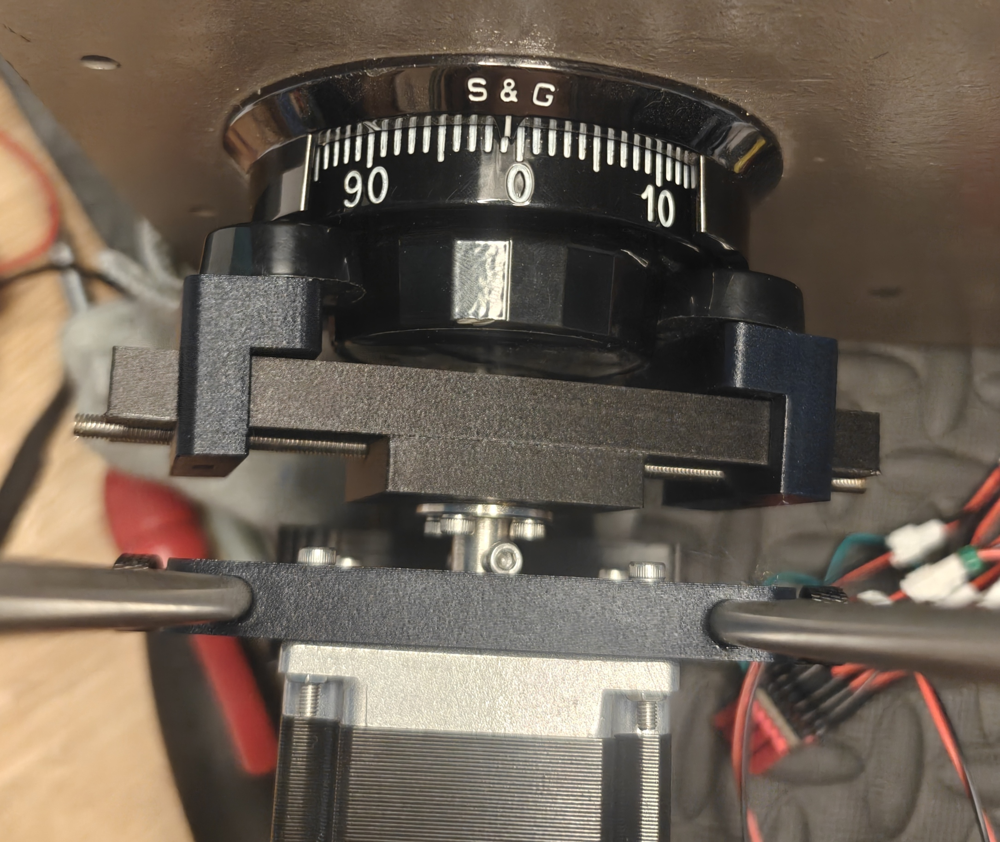

## Auto Dialer

Video: https://youtu.be/TwCeOCCC2Mc

An auto dialer is a device which automatically tries possible combinations for most group 2 and group 1 mechanical safe locks and stops when it detects the lock is open. Commercial auto dialers start at $2,000+ and are usually restrcited to locksmith or government purchases only. I strongly disagree with this mindset so here's one that beats all the others on the market and is only ~$100-$200 depending on where you live. I am far from the most capable so the source code is available for anyone to improve upon. 

Controls at:

Wifi Name: AutoDialer

Wifi Password: AutoDialer

Home Page: 192.168.0.1

Home Page Username: root

Home Page Password: toor

Disclaimer
----------
1. This device is not intended for any illegal purposes. Only use this on safes you own or have explicit permission to use it on.
2. This device is not guaranteed to open every safe.
3. This is a destructive opening device. It is most likely that some internals of the lock will be destroyed due to mechanical wear and need to be replaced. Speed does not change this. This is caused by the sheer amount of combinations being entered and will age the lock by decades. If the lock is an antique or rare lock, please consider manipulation first. If an auto dialer can open a lock, then manipulation can too.

Coming up: I've already built and tested a successful auto manipulator and will be producing them for sale. Like this project, all its parts and source code will be available.

## Bill of Materials

Links are U.S. based and may or may not work, they are just a suggestion and not the cheapest. Look at item name for what to get.

1x ESP32-S3 Zero: https://a.co/d/01cDdoZY

1x TMC5160T Pro v1.0: https://a.co/d/0hIy7H7A

1x Nema 23 2Nm 2.8A Stepper motor: https://www.omc-stepperonline.com/e-series-nema-23-bipolar-1-8deg-1-9nm-269oz-in-2-8a-3-2v-57x57x76mm-4-wires-23he30-2804s

1x 6.35mm flange coupler: https://a.co/d/0dyJOIjM

1x 24v + 5v power supply: https://a.co/d/09USCHyn

1x On/off switch with power socket: https://a.co/d/0g0ayNqc

1x Power cord: https://a.co/d/07m2ssTj

4x 1" rubber feet: https://a.co/d/7MgsYeb

1x 230lb magnet: https://www.kjmagnetics.com/fm1-48-single-sided-neodymium-fishing-magnet

2x 6mmx200mm steel rods: https://a.co/d/0bI4gr6S

1x m8x1.25 threaded rod: https://a.co/d/4OVZnbJ

1x m4x0.7x30mm left and right handed hex coupler: No stable link found. Should be 30mm long and no more than 7mm OD. This is half right hand threaded and half left hand threaded. Usually found on ebay.

1x m4x0.7 left hand threaded rod, at least 65mm long: https://a.co/d/grtvDES

1x m4x0.7 right hand threaded rod, at least 65mm long: https://a.co/d/84xLuza

1x m4x0.7 left hand nut: https://a.co/d/aEPH87D

1x m4x0.7 right hand nut: https://a.co/d/00hU0v1X

5x m3x10mm thumbturn: https://a.co/d/hM4cu5a

Various m3 bolts: https://a.co/d/0g7k9UIJ

Various m4 bolts: https://a.co/d/0d9DS9jq

Notes on compatibility:
My heat inserts are 5mm OD for m3 and 6mm OD for m4. The holes in the model are sized 4.8mm for the m3 inserts and 5.8mm for the m4 inserts. I've also found different m4 nuts to have different widths and thicknesses. The slot in the grip feet for the m4 nuts have a width of 7mm (one side of hex to the other) and a thickness of 3.25mm. The nuts should be a tight fit.

I have uploaded .step files for easier editing if anyone needs to change dimensions to fit their parts.

## Wiring

TMC5160

EN - Any GND

MOSI - ESP GPIO 3

SCK - ESP GPIO 4

CS - ESP GPIO 5

MISO - ESP GPIO 6

CLK - Any GND

STP - ESP GPIO 10

DIR - ESP GPIO 9

VM - Power supply 24v

GND - Power supply ground

A2 - Motor A-

A1 - Motor A+

B2 - Motor B-

B1 - Motor B+

VIO - ESP 3v

GND - ESP GND

DIAG0 - ESP GPIO 8

DIAG1 - ESP GPIO 7

ESP

5v - Power supply 5v

GND - Power supply ground, TMC5160 ground

3v - TMC5160 VIO

GPIO 3 - TMC5160 MOSI

GPIO 4 - TMC5160 SCK

GPIO 5 - TMC5160 CS

GPIO 6 - TMC5160 MISO

GPIO 7 - TMC5160 DIAG1

GPIO 8 - TMC5160 DIAG0

GPIO 9 - TMC5160 DIR

GPIO 10 - TMC5160 STP

Connect on/off switch to power supply.

## Build guide

Printed parts: Print 2 GripFeet and 1 of each of the other parts. I print in PETG-CF but PETG should be fine too. I would not use PLA. Use at least 5 walls, 5 top and bottom layers, and 50% infill. You shouldn't need any supports except for the GripFeet if your printer is bad at bridging.

GripFeet: One gets a left handed nut and one gets a right handed nut. Insert into slot on top, a pointy side of the nut in first. Each also gets 2 m4 heat set inserts in the holes facing up. Screw your rubber feet in with m4 bolts.
CouplerTop: 6 m3 heat inserts in the holes facing up. Screw the 6.35mm flange coupler onto the top.
MotorMount: 2 m3 heat inserts, 1 on each side. Each of these get an m3 thumb turn. Screw motor on with 4 m3 bolts and nuts.
LegSlide: 3 m3 heat inserts, 1 on each side and 1 on the back. Each of these get an m3 thumb turn.
Leg: Screw one end of the m8 bolt into the magnet and then screw it into the leg. 

Self centering screw: Take the m4 left/right hand coupler and thread in a left and right hand m4 rod into each side. I use locktite but superglue could work too. I cut each side to roughly 50mm long sticking out from the coupler. The important part is that each end is as close to the same length as each other as possible. I then cut a slot on each end so I can turn it with a flat head. The self centering screw will go between the CouplerTop and CouplerBottom and then the two halves screw together with 2 m3 bolts.

The GripFeet should have their nut pressed up against the self centering screw and then turn the screw to pull them both in. Really try to make sure they go on at the same time. 

The whole gripper assembly goes on the motor shaft.

Your 6mm rods go through the leg slide and motor mount.

## Arduino IDE Settings
Arduino IDE ver. 2.3.6

Board: ESP32S3 Dev Module

USB CDC on boot: Enabled

CPU Frequency: 240MHz (WiFi)

Core Debug Level: None

USB DFU On Boot: Disabled

Erase All Flash Before Sketch Upload: Disabled

Events Run On: Core 1

Flash Mode: QIO 80MHz

Flash Size: 4MB (32MB)

JTAG Adapter: Disabled

Arduino Runs On: Core 1

USB Firmware MSC On Boot: Disabled

Partition Scheme: Default 4MB with SPIFFS (1.2MB APP/1.5MB SPIFFS)

PSRAM: QSPI PSRAM

Upload Mode: UART0/Hardware CDC

Upload Speed: 921600

USB Mode: Hardware CDC and JTAG

If you're using Arduino IDE above version 1.8 (99.9% you are if you use Arduino IDE) then do this to upload the web page into the esp on board filesystem:

1. Make sure your arduino sketch project folder has a folder called 'data' with the web page files in it. The 'data' folder should be in the same directory as AutoDialer.ino.
2. Download the latest .vsix file from https://github.com/earlephilhower/arduino-littlefs-upload/releases (where these instructions come from).Put it in ~/.arduinoIDE/plugins/ on Mac and Linux or C:\Users<username>.arduinoIDE\plugins\ on Windows (you may need to make this directory yourself beforehand).
3. Restart the IDE.
4. Press [Ctrl] + [Shift] + [P], then type "Upload LittleFS to Pico/ESP8266/ESP32". If there's an error of not being able to use the serial port, close all serial monitors and plotters and try again. You may also have to restart Arduino IDE.

Libraries

Async TCP by ESP32Async ver. 3.4.7: https://github.com/ESP32Async/AsyncTCP

ESP Async WebServer by ESP32Async ver. 3.8.0: https://github.com/ESP32Async/ESPAsyncWebServer

TMCStepper by teemuatlut ver. 0.7.3: https://github.com/teemuatlut/TMCStepper

To do
-----
(I may not get around to any of this)
1. Improve calibration (or just read raw sg value) to add support for more speeds.
2. Add "Unknown" as an option for lock opening rotation and try both directions.
3. Sort all valid combinations more intelligently e.g. try all valid dates first.

## License
This project is licensed under the PolyForm Noncommercial License 1.0.0. 
You may use, modify, and distribute this software for non-commercial purposes only.
See [LICENSE](./LICENSE) for details.
